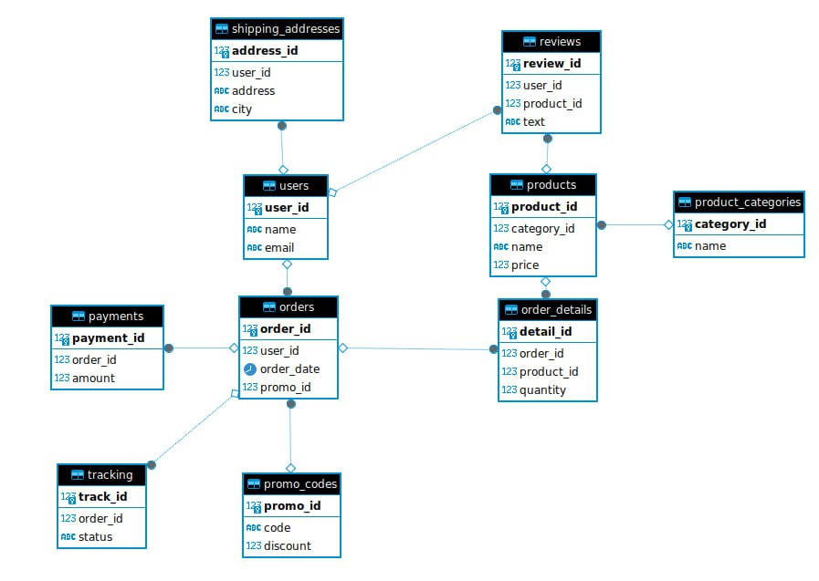

# Лабораторная работа № 2

## 1. Введение

Нам заказали сделать базу данных для онлайн магазина.

Основное тз:
* Нужно создать 10 связанных таблиц так как описано в главе "Таблицы"
* Нужно создать функции для заполнения этих таблиц, для тестирования
* Нужно создать функции для анализа продаж
* Нужно создать функции для расчета KPI продаж

## 2. Функции

### 2.1 Функции заполнения

Для каждой таблицы нужно создать функции, которые ее заполняют где в каждой таблице должно быть записей как в таблице

| № | table               | min | max |
|---|---------------------|-----|-----|
| 1 | Users               | 100 | 200 |
| 2 | Orders              | 800 | 999 |
| 3 | Products            |  20 | 100 |
| 4 | Order_Details       | 800 | 999 |
| 5 | Shipping_Addresses  | 100 | 200 |
| 6 | Payments            | 800 | 999 |
| 7 | Product_Categories  |   4 |  10 |
| 8 | Reviews             |  50 | 100 |
| 9 | Promo_Codes         |  10 |  50 |
|10 | Tracking            | 800 | 999 |

### 2.2 Функции для анализа продаж

1. **Средний чек заказа по категориям товаров**

2. **Топ-10 самых активных пользователей по количеству заказов**

3. **Количество отзывов на каждый продукт**

4. **Количество отзывов на каждую категорию**

5. **Среднее время доставки заказа в различные города**

### 2.3 Функции для расчетов KPI

1.  **Создание отчета по товарам**

    Функция должна заполнить таблицу даннымипо каждому товару:
    * продажах
    * выручке
    * средней цене 

2.  **Создание отчета по городам**

    Функция должна заполнить таблицу данными о городах:
    * среднее время заказа (время дня) 
    * количество заказов
    * средний чек
    * самый популярный товар

3. **Создание отчета по промокодам**

    Функция должна заполнить таблицу данными о промокодах:
    * кол-во использований
    * на какие товары чаще использовали промокоды
    * в каком городе чаще пользовались промокодами

4. **Создание отчета по отзывам**

    Функция должна заполнить таблицу данными об отзывах:
    * Средняя оценка
    * Средний размер отзыва
    * Самый частый товар
    * Самый активный пользователь
    * Самый активный город

## 3 Таблицы

3.1 **Пользователи (Users)**

| user_id | name   | email |
|---------|-------|-------|
|         |       |       |

Таблица содержит информацию о пользователях, зарегистрированных в системе. Включает их уникальный идентификатор (user_id), имя пользователя (name) и электронную почту (email).

3.2 **Заказы (Orders)**

| order_id | user_id | order_date | order_promo |
|----------|---------|------------|-------------|
|          |         |            |             |

Эта таблица отслеживает информацию о заказах, размещенных пользователями. Включает идентификатор заказа (order_id), идентификатор пользователя (user_id), который разместил заказ, и дату размещения заказа (order_date).

3.3 **Товары (Products)**

| product_id | name | price |
|------------|------|------|
|            |      |      |

Таблица содержит информацию о товарах, доступных для заказа. Включает уникальный идентификатор товара (product_id), название товара (name) и его цену (price).

3.4 **Детали заказа (Order_Details)**

| detail_id | order_id | product_id | quantity |
|-----------|----------|------------|------------|
|           |          |            |            |

Эта таблица содержит информацию о деталях каждого заказа, включая идентификатор детали (detail_id), идентификатор заказа (order_id), идентификатор продукта (product_id), связанный с заказом, и количество товаров (quantity), заказанных в каждой детали.

3.5 **Адреса доставки (Shipping_Addresses)**

| address_id | user_id | address | city |
|------------|---------|-------|-------|
|            |         |       |       |

Таблица содержит адреса доставки, связанные с каждым пользователем. Включает идентификатор адреса (address_id), идентификатор пользователя (user_id), адрес доставки (address) и город (city).

3.6 **Оплата (Payments)**

| payment_id | order_id | amount |
|------------|----------|-------|
|            |          |       |

Эта таблица содержит информацию о платежах за заказы. Включает идентификатор платежа (payment_id), идентификатор заказа (order_id), связанный с платежом, и сумму платежа (amount).

3.7 **Категории товаров (Product_Categories)**

| category_id | name |
|-------------|------|
|             |      |

Таблица содержит категории товаров. Включает уникальный идентификатор категории (category_id) и название категории (name).

3.8 **Отзывы (Reviews)**

| review_id | user_id | product_id | text |
|-----------|---------|------------|-------|
|           |         |            |       |

Эта таблица содержит отзывы, оставленные пользователями о товарах. Включает идентификатор отзыва (review_id), идентификатор пользователя (user_id), идентификатор товара (product_id) и текст отзыва (text).

3.9 **Промокоды (Promo_Codes)**

| promo_id | code  | discount |
|----------|------|--------|
|          |      |        |

Таблица содержит информацию о промокодах, которые могут быть использованы при оформлении заказа. Включает идентификатор промокода (promo_id), код промокода (code) и скидку, предоставляемую промокодом (discount).

3.10 **Отслеживание (Tracking)**

| track_id | order_id | status |
|----------|----------|--------|
|          |          |        |

Эта таблица отслеживает статус выполнения доставки для каждого заказа. Включает идентификатор отслеживания (track_id), идентификатор заказа (order_id), связанный с отслеживанием, и текущий статус (status) доставки.
