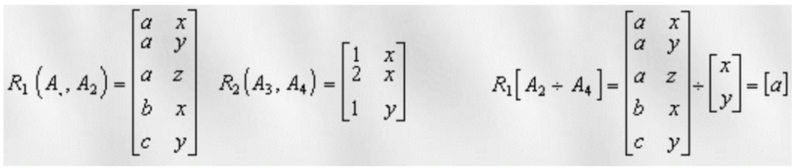

# Таблицы

## Таблица R

| M | P   | Q | T |
|---|-----|---|---|
| x | 101 | 5 | a |
| y | 105 | 3 | a |
| z | 500 | 9 | a |
| w |  50 | 1 | b |
| w |  10 | 2 | b |
| w | 300 | 4 | b |

```SQL
CREATE TABLE R (
    M CHAR(1),
    P INT,
    Q INT,
    T CHAR(1)
);

INSERT INTO R (M, P, Q, T) VALUES ('x', 101, 5, 'a');
INSERT INTO R (M, P, Q, T) VALUES ('y', 105, 3, 'a');
INSERT INTO R (M, P, Q, T) VALUES ('z', 500, 9, 'a');
INSERT INTO R (M, P, Q, T) VALUES ('w', 50, 1, 'b');
INSERT INTO R (M, P, Q, T) VALUES ('w', 10, 2, 'b');
INSERT INTO R (M, P, Q, T) VALUES ('w', 300, 4, 'b');
```
Этот код создает таблицу **R** с четырьмя столбцами: **M** (тип CHAR(1)), **P** (тип INT), **Q** (тип INT), и **T** (тип CHAR(1)). Затем он вставляет данные в эту таблицу, в точности так, как они представлены в вашем примере.

## Таблица S

| A   | B   |
| --- | --- |
| 5   | a   |
| 10  | b   |
| 15  | c   |
| 2   | d   |
| 6   | a   |
| 1   | b   |


```SQL
CREATE TABLE S(
    A INTEGER,
    B CHAR
);

INSERT INTO S VALUES
    ( '5', 'a'),
    ('10', 'b'),
    ('15', 'c'),
    ( '2', 'd'),
    ( '6', 'a'),
    ( '1', 'b');
```

Этот код создает таблицу **S** с двумя столбцами: **A**, ожидающим целочисленные значения, и **B**, ожидающим символьные строки. Затем он вставляет данные в эту таблицу, включая целочисленные значения и символы, в каждую строку, заданные в скобках.

## Таблица P

```SQL
CREATE TABLE P(
    D1 CHAR,
    D2 INTEGER, 
    D3 CHAR
);
	
INSERT INTO P VALUES 
    ('1', '11', 'x'),
    ('2', '11', 'y'),
    ('3', '11', 'z'),
    ('4', '12', 'x');
```

Этот SQL код создает таблицу P с тремя столбцами: D1 типа CHAR, D2 типа INTEGER, и D3 типа CHAR. Затем он вставляет четыре строки данных в таблицу P, где каждая строка состоит из значений для столбцов D1, D2, и D3.

## Таблица Q

| D4 | D5 |
|----|----|
| x  | 1  |
| x  | 2  |
| y  | 1  |

```SQL
CREATE TABLE Q(
    D4 CHAR,
    D5 INTEGER
);

INSERT INTO Q VALUES 
    ('x', '1'),
    ('x', '2'),
    ('y', '1');
```

Этот код создает таблицу с именем Q, содержащую два столбца: D4 типа CHAR и D5 типа INTEGER. Затем он вставляет три строки данных в эту таблицу. Каждая строка содержит значение для столбца D4 (символ 'x' или 'y') и значение для столбца D5 (целое число).

## Таблица R1

| A1 | A2 |
|----|----|
| a  | x  |
| a  | y  |
| a  | z  |
| b  | x  |
| c  | x  |

```SQL
CREATE TABLE R1(
    A1 CHAR,
    A2 CHAR
);
	
INSERT INTO R1 VALUES 
    ('a', 'x'),
    ('a', 'y'),
    ('a', 'z'),
    ('b', 'x'),
    ('c', 'x');
```

Этот код создает таблицу R1 с двумя столбцами: A1 и A2, оба имеют тип данных CHAR. Затем он вставляет пять строк данных в эту таблицу. Каждая строка содержит значение для столбца A1 (символ 'a', 'b' или 'c') и значение для столбца A2 (символ 'x', 'y' или 'z').

## Таблица R2

| A3 | A4 |
|----|----|
| 1  | x  |
| 2  | x  |
| 1  | y  |

```SQL
CREATE TABLE R2(
    A3 INTEGER,
    A4 CHAR
);

INSERT INTO R2 VALUES 
    ('1', 'x'),
    ('2', 'x'),
    ('1', 'y');
```

Этот код создает таблицу R2 с двумя столбцами: A3, который имеет тип данных INTEGER, и A4, который имеет тип данных CHAR. Затем он вставляет три строки данных в эту таблицу, где каждая строка содержит значение для столбца A3 (целое число) и значение для столбца A4 (символ 'x' или 'y').

# Операции

## PROJECTION (ПРОЕКЦИЯ)


```SQL
SELECT DISTINCT ON (M, T) M, T FROM R;
```

Функция выше выполняет выборку уникальных комбинаций значений столбцов M и T из таблицы R. Давайте подробнее разберем, что делает эта функция:

1. **SELECT DISTINCT ON (M, T)**: Эта часть запроса указывает, что нам нужно выбрать уникальные комбинации значений столбцов M и T. Это означает, что в результате будут уникальные записи, где комбинация значений столбцов M и T будет различаться.
2. **M, T**: Здесь мы указываем, какие столбцы из таблицы R мы хотим выбрать. В данном случае, это столбцы M и T.
3. **FROM R**: Это указывает на то, что мы выбираем данные из таблицы R.
4. **DISTINCT ON (M, T)**: Эта часть особенная. Она означает, что хотя в исходной таблице могут быть дубликаты комбинаций (M, T), нам нужно выбрать только одну запись для каждой уникальной комбинации значений M и T. Обычно, в PostgreSQL, где эта конструкция часто встречается, строка, возвращаемая запросом, будет первой строкой для каждой уникальной комбинации (M, T), согласно порядку сортировки, если он задан.

## UNION (ОБЪЕДИНЕНИЕ)


```SQL
SELECT * FROM 
    (SELECT DISTINCT ON (Q, T) Q, T FROM R)
    UNION SELECT * FROM S;
```

1. **SELECT DISTINCT ON (Q, T) Q, T FROM R**: Этот внутренний подзапрос выбирает уникальные комбинации значений столбцов Q и T из таблицы R с помощью оператора DISTINCT ON (Q, T). Это означает, что будет выбрана только одна строка для каждой уникальной комбинации значений Q и T.
2. **(SELECT DISTINCT ON (Q, T) Q, T FROM R)**: Этот подзапрос выступает как временная таблица, результатом которого являются уникальные комбинации столбцов Q и T из таблицы R.
3. **UNION**: Это ключевое слово используется для объединения результатов двух запросов и удаления повторяющихся строк.
4. **SELECT * FROM S**: Это вторая часть запроса, которая выбирает все строки и столбцы из таблицы S.

Таким образом, вся команда **SELECT * FROM (SELECT DISTINCT ON (Q, T) Q, T FROM R) UNION SELECT * FROM S**; выбирает все уникальные комбинации значений столбцов Q и T из таблицы R, а затем объединяет их с данными из таблицы S.


## INTERSECT (ПЕРЕСЕЧЕНИЕ)


```SQL
SELECT * FROM 
    (SELECT DISTINCT ON (Q, T) Q, T FROM R)
INTERSECT SELECT * FROM S
```

1. **SELECT DISTINCT ON (Q, T) Q, T FROM R**: Внутренний запрос выбирает уникальные комбинации значений столбцов Q и T из таблицы R с помощью оператора DISTINCT ON (Q, T). Таким образом, он формирует временный набор данных, содержащий только уникальные комбинации значений столбцов Q и T.
2. **SELECT * FROM S**: Этот запрос выбирает все строки и столбцы из таблицы S.
3. **INTERSECT**: Оператор INTERSECT объединяет результаты двух запросов и возвращает только те строки, которые присутствуют в обоих результатах. В данном случае, он выбирает строки, которые одновременно присутствуют и во временном наборе данных (уникальные комбинации из таблицы R), и в таблице S.
4. **SELECT * FROM (SELECT DISTINCT ON (Q, T) Q, T FROM R) INTERSECT SELECT * FROM S**: Внешний запрос объединяет результаты внутреннего запроса и запроса к таблице S, возвращая только те строки, которые являются общими для обоих наборов данных.

Итак, результатом этого запроса будет набор данных, содержащий только те уникальные комбинации значений столбцов Q и T, которые присутствуют и в таблице R, и в таблице S.


## CARTESIAN PRODUCT (ДЕКАРТОВО ПРОИЗВЕДЕНИЕ)


```SQL
SELECT * FROM
    (SELECT * FROM (SELECT DISTINCT ON (Q, T) Q, T FROM R) 
        INTERSECT SELECT * FROM S), 
    (SELECT DISTINCT ON (M, T) M, T FROM R)
```

1. Внутренний запрос:
    * **SELECT DISTINCT ON (Q, T) Q, T FROM R**: Этот внутренний запрос выбирает уникальные комбинации значений столбцов Q и T из таблицы R с помощью оператора DISTINCT ON (Q, T). Таким образом, он формирует временный набор данных, содержащий только уникальные комбинации значений столбцов Q и T.
    * **INTERSECT SELECT * FROM S**: Здесь происходит операция пересечения (INTERSECT). Результатом будет набор данных, содержащий только те строки, которые присутствуют и во временном наборе данных (уникальные комбинации из таблицы R), и в таблице S.
Второй внутренний запрос:
2. **SELECT DISTINCT ON (M, T) M, T FROM R**: Этот второй внутренний запрос выбирает уникальные комбинации значений столбцов M и T из таблицы R с помощью оператора DISTINCT ON (M, T).
Внешний запрос:
3. **SELECT * FROM (...)**: Внешний запрос объединяет результаты двух внутренних запросов. Обратите внимание на использование скобок для обозначения подзапросов.

Таким образом, в результате запроса будет возвращен набор данных, содержащий результаты пересечения уникальных комбинаций значений столбцов Q и T из таблицы R с таблицей S, а также уникальные комбинации значений столбцов M и T из таблицы R.


## JOIN (СОЕДИНЕНИЕ)


```SQL
SELECT D1, D2, D3, D5
    FROM P, Q
    WHERE P.D3 = Q.D4
```
Этот SQL-запрос выбирает значения столбцов D1, D2, D3 из таблицы P и значение столбца D5 из таблицы Q, где значение столбца D3 из таблицы P равно значению столбца D4 из таблицы Q.

В данном случае, запрос осуществляет соединение (JOIN) таблиц P и Q на основе условия равенства значений столбцов D3 из P и D4 из Q. После соединения, он выбирает указанные столбцы из результатов соединения, где условие соответствия выполнено.

## DIVISION (ДЕЛЕНИЕ)



```SQL
SELECT A1
    FROM R1
    WHERE R1.A2 NOT IN (SELECT A4 FROM R2);
```

Этот SQL-запрос выбирает значения из столбца A1 таблицы R1, где значение столбца A2 в таблице R1 отсутствует в столбце A4 таблицы R2.

Таким образом, запрос фильтрует строки из таблицы R1 по следующему условию: он выбирает только те строки, где значение столбца A2 из таблицы R1 не встречается в столбце A4 таблицы R2.
