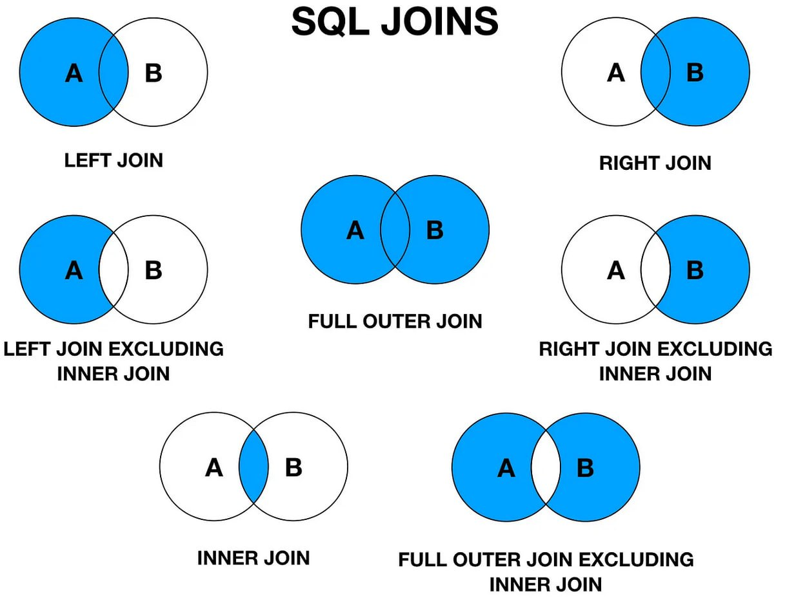

# Joins



## Данные

### users
| user_id |  username      |       email           | age | gender | registration_date |
|---------|----------------|-----------------------|-----|--------|-------------------|
|    1    |   John Doe     |  john@example.com     |  30 |  Male  |    1990-05-15     |
|    2    |  Jane Smith    |  jane@example.com     |  25 | Female |    1995-02-20     |
|    3    | Alice Johnson  |  alice@example.com    |  35 | Female |    1989-11-10     |
|    4    |  Bob Williams  |  bob@example.com      |  40 |  Male  |    1982-08-25     |
|    5    |  Emma Brown    |  emma@example.com     |  28 | Female |    1993-04-30     |
|    6    | Michael Johnson| michael@example.com   |  45 |  Male  |    1979-12-15     |
|    7    |  Sarah Green   |  sarah@example.com    |  33 | Female |    1988-09-28     |

```SQL
CREATE TABLE users (
    user_id SERIAL PRIMARY KEY,
    username VARCHAR(50),
    email VARCHAR(100),
    age INT,
    gender VARCHAR(10),
    registration_date DATE
);

INSERT INTO users (username, email, age, gender, registration_date) VALUES
    ('John Doe', 'john@example.com', 30, 'Male', '1990-05-15'),
    ('Jane Smith', 'jane@example.com', 25, 'Female', '1995-02-20'),
    ('Alice Johnson', 'alice@example.com', 35, 'Female', '1989-11-10'),
    ('Bob Williams', 'bob@example.com', 40, 'Male', '1982-08-25'),
    ('Emma Brown', 'emma@example.com', 28, 'Female', '1993-04-30'),
    ('Michael Johnson', 'michael@example.com', 45, 'Male', '1979-12-15'),
    ('Sarah Green', 'sarah@example.com', 33, 'Female', '1988-09-28');

```

Этот фрагмент SQL кода выполняет следующие действия:

1. CREATE TABLE users: Создает новую таблицу под названием "users". В этой таблице будут храниться данные о пользователях.
    * user_id SERIAL PRIMARY KEY: Создает столбец user_id, который будет автоматически увеличиваться для каждой новой записи (SERIAL), и он также является первичным ключом (PRIMARY KEY) таблицы. Это означает, что каждое значение user_id должно быть уникальным и не может быть NULL.

    * username VARCHAR(50): Создает столбец для хранения имен пользователей. VARCHAR(50) определяет, что это строковое поле переменной длины, где 50 - максимальная длина строки.

    * email VARCHAR(100): Создает столбец для хранения адресов электронной почты пользователей.

    * age INT: Создает столбец для хранения возраста пользователей. INT означает целочисленный тип данных.

    * gender VARCHAR(10): Создает столбец для хранения пола пользователей.

    * registration_date DATE: Создает столбец для хранения даты регистрации пользователей. DATE - тип данных для даты.

2. INSERT INTO users: Добавляет данные в таблицу "users".

    * Каждый кортеж значений вставляется в таблицу, представляя отдельного пользователя с указанными данными:

        * Имя пользователя (username)
        * Адрес электронной почты (email)
        * Возраст (age)
        * Пол (gender)
        * Дата регистрации (registration_date)
    * Каждая запись создает новую строку в таблице "users" с уникальным идентификатором пользователя, предоставленными данными и датой регистрации.

### orders
| order_id | user_id |       product         |  amount  |
|----------|---------|-----------------------|----------|
|    1     |    1    |       Laptop          |  1200.00 |
|    2     |    1    |      Headphones       |   100.00 |
|    3     |    2    |       Keyboard        |    50.00 |
|    4     |    3    |         Mouse         |    20.00 |
|    5     |    4    |       Monitor         |   300.00 |
|    6     |    4    | External Hard Drive   |    80.00 |
|    7     |    5    |       Webcam          |    45.00 |
|    8     |    5    |       Printer         |   150.00 |
|    9     |    7    |      Microphone       |    70.00 |
|   10     |    7    |      Smartphone       |   600.00 |
|   11     |    8    |        Tablet         |   200.00 |

```SQL
CREATE TABLE orders (
    order_id SERIAL PRIMARY KEY,
    user_id INTEGER,
    product VARCHAR(100),
    amount NUMERIC(10, 2)
);

INSERT INTO orders (user_id, product, amount) VALUES
    (1, 'Laptop', 1200.00),
    (1, 'Headphones', 100.00),
    (2, 'Keyboard', 50.00),
    (3, 'Mouse', 20.00),
    (4, 'Monitor', 300.00),
    (4, 'External Hard Drive', 80.00),
    (5, 'Webcam', 45.00),
    (5, 'Printer', 150.00),
    (7, 'Microphone', 70.00),
    (7, 'Smartphone', 600.00),
    (8, 'Tablet', 200.00);
```

Этот фрагмент SQL кода выполняет следующие действия:

1. CREATE TABLE orders: Создает новую таблицу под названием "orders". В этой таблице будут храниться данные о заказах.

    * order_id SERIAL PRIMARY KEY: Создает столбец order_id, который будет автоматически увеличиваться для каждой новой записи (SERIAL), и он также является первичным ключом (PRIMARY KEY) таблицы. Это означает, что каждое значение order_id должно быть уникальным и не может быть NULL.

    * user_id INTEGER user_id: Создает столбец для хранения идентификаторов пользователей.

    * product VARCHAR(100): Создает столбец для хранения названий продуктов заказов.

    * amount NUMERIC(10, 2): Создает столбец для хранения суммы заказа. NUMERIC(10, 2) указывает, что это числовое поле с общей длиной 10 цифр и 2 знаками после запятой, что позволяет хранить денежные значения с точностью до двух знаков после запятой.

2. INSERT INTO orders: Добавляет данные в таблицу "orders".

    * Каждый кортеж значений вставляется в таблицу, представляя отдельный заказ с указанными данными:

        * Идентификатор пользователя (user_id), который ссылается на идентификатор пользователя в таблице "users".
        * Название продукта (product).
        * Сумма заказа (amount).
    * Каждая запись создает новую строку в таблице "orders" с уникальным идентификатором заказа, а также информацией о пользователе, продукте и сумме заказа.

## 1. INNER JOIN
Возвращает только те строки, которые имеют соответствующие значения в обеих таблицах. Если нет совпадений, строки из обеих таблиц не включаются в результат.
```SQL
SELECT *
FROM users
INNER JOIN orders ON users.user_id = orders.user_id;
```
Этот SQL запрос выполняет операцию объединения (JOIN) между таблицами "users" и "orders" с использованием INNER JOIN. Давайте рассмотрим каждую часть запроса:

1. SELECT *: Это ключевое слово указывает базе данных на то, что мы хотим выбрать все столбцы из результатов запроса.

2. FROM users: Это указывает базе данных на таблицу, из которой мы хотим выбрать данные. В данном случае, мы выбираем данные из таблицы "users".

3. INNER JOIN orders ON users.user_id = orders.user_id: Это синтаксис INNER JOIN, который соединяет строки из таблицы "users" со строками из таблицы "orders" на основе условия, что значения в столбце user_id совпадают в обеих таблицах.

| "user_id" |      "username" |             "email" | "age" | "gender" | "registration_date" | "order_id" | "user_id-2" |             "product" | "amount" |
|----------:|----------------:|--------------------:|------:|---------:|--------------------:|-----------:|------------:|----------------------:|---------:|
|         1 |      "John Doe" |  "john@example.com" |    30 |   "Male" |        "1990-05-15" |          1 |           1 |              "Laptop" |  1200.00 |
|         1 |      "John Doe" |  "john@example.com" |    30 |   "Male" |        "1990-05-15" |          2 |           1 |          "Headphones" |   100.00 |
|         2 |    "Jane Smith" |  "jane@example.com" |    25 | "Female" |        "1995-02-20" |          3 |           2 |            "Keyboard" |    50.00 |
|         3 | "Alice Johnson" | "alice@example.com" |    35 | "Female" |        "1989-11-10" |          4 |           3 |               "Mouse" |    20.00 |
| 4         | "Bob Williams"  | "bob@example.com"   | 40    | "Male"   | "1982-08-25"        | 5          | 4           | "Monitor"             | 300.00   |
| 4         | "Bob Williams"  | "bob@example.com"   | 40    | "Male"   | "1982-08-25"        | 6          | 4           | "External Hard Drive" | 80.00    |
| 5         | "Emma Brown"    | "emma@example.com"  | 28    | "Female" | "1993-04-30"        | 7          | 5           | "Webcam"              | 45.00    |
| 5         | "Emma Brown"    | "emma@example.com"  | 28    | "Female" | "1993-04-30"        | 8          | 5           | "Printer"             | 150.00   |
| 7         | "Sarah Green"   | "sarah@example.com" | 33    | "Female" | "1988-09-28"        | 9          | 7           | "Microphone"          | 70.00    |
| 7         | "Sarah Green"   | "sarah@example.com" | 33    | "Female" | "1988-09-28"        | 10         | 7           | "Smartphone"          | 600.00   |

## 2. LEFT OUTER JOIN (или просто LEFT JOIN)
Возвращает все строки из левой таблицы (первой указанной в запросе), а также соответствующие строки из правой таблицы. Если в правой таблице нет совпадающих значений, используются NULL значения.
```SQL
SELECT *
FROM users
LEFT JOIN orders ON users.user_id = orders.user_id;
```
Этот SQL запрос выполняет операцию объединения (JOIN) между таблицами "users" и "orders" с использованием LEFT JOIN. Давайте разберем его:

1. SELECT *: Это ключевое слово указывает базе данных на то, что мы хотим выбрать все столбцы из результатов запроса.

2. FROM users: Это указывает базе данных на таблицу, из которой мы хотим выбрать данные. В данном случае, мы выбираем данные из таблицы "users".

3. LEFT JOIN orders ON users.user_id = orders.user_id: Это синтаксис LEFT JOIN, который соединяет строки из таблицы "users" со строками из таблицы "orders" на основе условия, что значения в столбце user_id совпадают в обеих таблицах.

| "user_id" |        "username" |               "email" | "age" | "gender" | "registration_date" | "order_id" | "user_id-2" |             "product" | "amount" |
|----------:|------------------:|----------------------:|------:|---------:|--------------------:|-----------:|------------:|----------------------:|---------:|
|         1 |        "John Doe" |    "john@example.com" |    30 |   "Male" |        "1990-05-15" |          1 |           1 |              "Laptop" |  1200.00 |
|         1 |        "John Doe" |    "john@example.com" |    30 |   "Male" |        "1990-05-15" |          2 |           1 |          "Headphones" |   100.00 |
|         2 |      "Jane Smith" |    "jane@example.com" |    25 | "Female" |        "1995-02-20" |          3 |           2 |            "Keyboard" |    50.00 |
|         3 |   "Alice Johnson" |   "alice@example.com" |    35 | "Female" |        "1989-11-10" |          4 |           3 |               "Mouse" |    20.00 |
| 4         | "Bob Williams"    | "bob@example.com"     | 40    | "Male"   | "1982-08-25"        | 5          | 4           | "Monitor"             | 300.00   |
| 4         | "Bob Williams"    | "bob@example.com"     | 40    | "Male"   | "1982-08-25"        | 6          | 4           | "External Hard Drive" | 80.00    |
| 5         | "Emma Brown"      | "emma@example.com"    | 28    | "Female" | "1993-04-30"        | 7          | 5           | "Webcam"              | 45.00    |
| 5         | "Emma Brown"      | "emma@example.com"    | 28    | "Female" | "1993-04-30"        | 8          | 5           | "Printer"             | 150.00   |
| 7         | "Sarah Green"     | "sarah@example.com"   | 33    | "Female" | "1988-09-28"        | 9          | 7           | "Microphone"          | 70.00    |
| 7         | "Sarah Green"     | "sarah@example.com"   | 33    | "Female" | "1988-09-28"        | 10         | 7           | "Smartphone"          | 600.00   |
| 6         | "Michael Johnson" | "michael@example.com" | 45    | "Male"   | "1979-12-15"        |            |             |                       |          |

## 3. RIGHT OUTER JOIN (или просто RIGHT JOIN)
Возвращает все строки из правой таблицы и соответствующие строки из левой таблицы. Если в левой таблице нет совпадающих значений, используются NULL значения.
```SQL
SELECT *
FROM users
RIGHT JOIN orders ON users.user_id = orders.user_id;
```
Этот SQL запрос выполняет операцию объединения (JOIN) между таблицами "users" и "orders" с использованием RIGHT JOIN. Давайте разберем его:

1. SELECT *: Это ключевое слово указывает базе данных на то, что мы хотим выбрать все столбцы из результатов запроса.

2. FROM users: Это указывает базе данных на таблицу, из которой мы хотим выбрать данные. В данном случае, мы выбираем данные из таблицы "users".

3. RIGHT JOIN orders ON users.user_id = orders.user_id: Это синтаксис RIGHT JOIN, который соединяет строки из таблицы "orders" со строками из таблицы "users" на основе условия, что значения в столбце user_id совпадают в обеих таблицах.

| "user_id" |      "username" |             "email" |  "age" | "gender" | "registration_date" | "order_id" | "user_id-2" |             "product" | "amount" |
|----------:|----------------:|--------------------:|-------:|---------:|--------------------:|-----------:|------------:|----------------------:|---------:|
|         1 |      "John Doe" |  "john@example.com" |     30 |   "Male" |        "1990-05-15" |          1 |           1 |              "Laptop" |  1200.00 |
|         1 |      "John Doe" |  "john@example.com" |     30 |   "Male" |        "1990-05-15" |          2 |           1 |          "Headphones" |   100.00 |
|         2 |    "Jane Smith" |  "jane@example.com" |     25 | "Female" |        "1995-02-20" |          3 |           2 |            "Keyboard" |    50.00 |
|         3 | "Alice Johnson" | "alice@example.com" |     35 | "Female" |        "1989-11-10" |          4 |           3 |               "Mouse" |    20.00 |
| 4         | "Bob Williams"  | "bob@example.com"   | 40     | "Male"   | "1982-08-25"        | 5          | 4           | "Monitor"             | 300.00   |
| 4         | "Bob Williams"  | "bob@example.com"   | 40     | "Male"   | "1982-08-25"        | 6          | 4           | "External Hard Drive" | 80.00    |
| 5         | "Emma Brown"    | "emma@example.com"  | 28     | "Female" | "1993-04-30"        | 7          | 5           | "Webcam"              | 45.00    |
| 5         | "Emma Brown"    | "emma@example.com"  | 28     | "Female" | "1993-04-30"        | 8          | 5           | "Printer"             | 150.00   |
| 7         | "Sarah Green"   | "sarah@example.com" | 33     | "Female" | "1988-09-28"        | 9          | 7           | "Microphone"          | 70.00    |
| 7         | "Sarah Green"   | "sarah@example.com" | 33     | "Female" | "1988-09-28"        | 10         | 7           | "Smartphone"          | 600.00   |
||||||| 11        | 8               | "Tablet"            | 200.00 |          |                     |            |             |                       |          |

## 4. FULL OUTER JOIN (или просто FULL JOIN)
Возвращает строки, когда есть совпадения в любой из таблиц. То есть он возвращает все строки из левой таблицы и все строки из правой таблицы, объединяя их по условию. Если нет совпадений, используются NULL значения.
```SQL
SELECT *
FROM users
FULL JOIN orders ON users.user_id = orders.user_id;
```

Этот SQL запрос выполняет операцию объединения (JOIN) между таблицами "users" и "orders" с использованием FULL JOIN. Давайте разберем его:

1. SELECT *: Это ключевое слово указывает базе данных на то, что мы хотим выбрать все столбцы из результатов запроса.

2. FROM users: Это указывает базе данных на таблицу, из которой мы хотим выбрать данные. В данном случае, мы выбираем данные из таблицы "users".

3. FULL JOIN orders ON users.user_id = orders.user_id: Это синтаксис FULL JOIN, который соединяет строки из таблицы "users" и "orders" на основе условия, что значения в столбце user_id совпадают в обеих таблицах.

| "user_id" |        "username" |               "email" |  "age" | "gender" | "registration_date" | "order_id" | "user_id-2" |             "product" | "amount" |
|----------:|------------------:|----------------------:|-------:|---------:|--------------------:|-----------:|------------:|----------------------:|---------:|
|         1 |        "John Doe" |    "john@example.com" |     30 |   "Male" |        "1990-05-15" |          1 |           1 |              "Laptop" |  1200.00 |
|         1 |        "John Doe" |    "john@example.com" |     30 |   "Male" |        "1990-05-15" |          2 |           1 |          "Headphones" |   100.00 |
|         2 |      "Jane Smith" |    "jane@example.com" |     25 | "Female" |        "1995-02-20" |          3 |           2 |            "Keyboard" |    50.00 |
|         3 |   "Alice Johnson" |   "alice@example.com" |     35 | "Female" |        "1989-11-10" |          4 |           3 |               "Mouse" |    20.00 |
| 4         | "Bob Williams"    | "bob@example.com"     | 40     | "Male"   | "1982-08-25"        | 5          | 4           | "Monitor"             | 300.00   |
| 4         | "Bob Williams"    | "bob@example.com"     | 40     | "Male"   | "1982-08-25"        | 6          | 4           | "External Hard Drive" | 80.00    |
| 5         | "Emma Brown"      | "emma@example.com"    | 28     | "Female" | "1993-04-30"        | 7          | 5           | "Webcam"              | 45.00    |
| 5         | "Emma Brown"      | "emma@example.com"    | 28     | "Female" | "1993-04-30"        | 8          | 5           | "Printer"             | 150.00   |
| 7         | "Sarah Green"     | "sarah@example.com"   | 33     | "Female" | "1988-09-28"        | 9          | 7           | "Microphone"          | 70.00    |
| 7         | "Sarah Green"     | "sarah@example.com"   | 33     | "Female" | "1988-09-28"        | 10         | 7           | "Smartphone"          | 600.00   |
||||||| 11        | 8                 | "Tablet"              | 200.00 |          |                     |            |             |                       |          |
| 6         | "Michael Johnson" | "michael@example.com" | 45     | "Male"   | "1979-12-15"        |            |             |                       |          |

## 5. CROSS JOIN
Возвращает декартово произведение всех строк из двух таблиц. Это означает, что каждая строка из одной таблицы комбинируется с каждой строкой из другой таблицы, образуя все возможные комбинации.
```SQL
SELECT *
FROM users
CROSS JOIN orders;
```

Этот SQL запрос выполняет операцию кросс-соединения (CROSS JOIN) между таблицами "users" и "orders". Давайте разберем его:

1. SELECT *: Это ключевое слово указывает базе данных на то, что мы хотим выбрать все столбцы из результатов запроса.

2. FROM users: Это указывает базе данных на таблицу, из которой мы хотим выбрать данные. В данном случае, мы выбираем данные из таблицы "users".

3. CROSS JOIN orders: Это синтаксис CROSS JOIN, который производит декартово произведение двух таблиц, то есть комбинирует каждую строку из таблицы "users" с каждой строкой из таблицы "orders".

| "user_id" |        "username" |               "email" | "age" | "gender" | "registration_date" | "order_id" | "user_id-2" |             "product" | "amount" |
|----------:|------------------:|----------------------:|------:|---------:|--------------------:|-----------:|------------:|----------------------:|---------:|
|         1 |        "John Doe" |    "john@example.com" |    30 |   "Male" |        "1990-05-15" |          1 |           1 |              "Laptop" |  1200.00 |
|         2 |      "Jane Smith" |    "jane@example.com" |    25 | "Female" |        "1995-02-20" |          1 |           1 |              "Laptop" |  1200.00 |
|         3 |   "Alice Johnson" |   "alice@example.com" |    35 | "Female" |        "1989-11-10" |          1 |           1 |              "Laptop" |  1200.00 |
|         4 |    "Bob Williams" |     "bob@example.com" |    40 |   "Male" |        "1982-08-25" |          1 |           1 |              "Laptop" |  1200.00 |
| 5         | "Emma Brown"      | "emma@example.com"    | 28    | "Female" | "1993-04-30"        | 1          | 1           | "Laptop"              | 1200.00  |
| 6         | "Michael Johnson" | "michael@example.com" | 45    | "Male"   | "1979-12-15"        | 1          | 1           | "Laptop"              | 1200.00  |
| 7         | "Sarah Green"     | "sarah@example.com"   | 33    | "Female" | "1988-09-28"        | 1          | 1           | "Laptop"              | 1200.00  |
| 1         | "John Doe"        | "john@example.com"    | 30    | "Male"   | "1990-05-15"        | 2          | 1           | "Headphones"          | 100.00   |
| 2         | "Jane Smith"      | "jane@example.com"    | 25    | "Female" | "1995-02-20"        | 2          | 1           | "Headphones"          | 100.00   |
| 3         | "Alice Johnson"   | "alice@example.com"   | 35    | "Female" | "1989-11-10"        | 2          | 1           | "Headphones"          | 100.00   |
| 4         | "Bob Williams"    | "bob@example.com"     | 40    | "Male"   | "1982-08-25"        | 2          | 1           | "Headphones"          | 100.00   |
| 5         | "Emma Brown"      | "emma@example.com"    | 28    | "Female" | "1993-04-30"        | 2          | 1           | "Headphones"          | 100.00   |
| 6         | "Michael Johnson" | "michael@example.com" | 45    | "Male"   | "1979-12-15"        | 2          | 1           | "Headphones"          | 100.00   |
| 7         | "Sarah Green"     | "sarah@example.com"   | 33    | "Female" | "1988-09-28"        | 2          | 1           | "Headphones"          | 100.00   |
| 1         | "John Doe"        | "john@example.com"    | 30    | "Male"   | "1990-05-15"        | 3          | 2           | "Keyboard"            | 50.00    |
| 2         | "Jane Smith"      | "jane@example.com"    | 25    | "Female" | "1995-02-20"        | 3          | 2           | "Keyboard"            | 50.00    |
| 3         | "Alice Johnson"   | "alice@example.com"   | 35    | "Female" | "1989-11-10"        | 3          | 2           | "Keyboard"            | 50.00    |
| 4         | "Bob Williams"    | "bob@example.com"     | 40    | "Male"   | "1982-08-25"        | 3          | 2           | "Keyboard"            | 50.00    |
| 5         | "Emma Brown"      | "emma@example.com"    | 28    | "Female" | "1993-04-30"        | 3          | 2           | "Keyboard"            | 50.00    |
| 6         | "Michael Johnson" | "michael@example.com" | 45    | "Male"   | "1979-12-15"        | 3          | 2           | "Keyboard"            | 50.00    |
| 7         | "Sarah Green"     | "sarah@example.com"   | 33    | "Female" | "1988-09-28"        | 3          | 2           | "Keyboard"            | 50.00    |
| 1         | "John Doe"        | "john@example.com"    | 30    | "Male"   | "1990-05-15"        | 4          | 3           | "Mouse"               | 20.00    |
| 2         | "Jane Smith"      | "jane@example.com"    | 25    | "Female" | "1995-02-20"        | 4          | 3           | "Mouse"               | 20.00    |
| 3         | "Alice Johnson"   | "alice@example.com"   | 35    | "Female" | "1989-11-10"        | 4          | 3           | "Mouse"               | 20.00    |
| 4         | "Bob Williams"    | "bob@example.com"     | 40    | "Male"   | "1982-08-25"        | 4          | 3           | "Mouse"               | 20.00    |
| 5         | "Emma Brown"      | "emma@example.com"    | 28    | "Female" | "1993-04-30"        | 4          | 3           | "Mouse"               | 20.00    |
| 6         | "Michael Johnson" | "michael@example.com" | 45    | "Male"   | "1979-12-15"        | 4          | 3           | "Mouse"               | 20.00    |
| 7         | "Sarah Green"     | "sarah@example.com"   | 33    | "Female" | "1988-09-28"        | 4          | 3           | "Mouse"               | 20.00    |
| 1         | "John Doe"        | "john@example.com"    | 30    | "Male"   | "1990-05-15"        | 5          | 4           | "Monitor"             | 300.00   |
| 2         | "Jane Smith"      | "jane@example.com"    | 25    | "Female" | "1995-02-20"        | 5          | 4           | "Monitor"             | 300.00   |
| 3         | "Alice Johnson"   | "alice@example.com"   | 35    | "Female" | "1989-11-10"        | 5          | 4           | "Monitor"             | 300.00   |
| 4         | "Bob Williams"    | "bob@example.com"     | 40    | "Male"   | "1982-08-25"        | 5          | 4           | "Monitor"             | 300.00   |
| 5         | "Emma Brown"      | "emma@example.com"    | 28    | "Female" | "1993-04-30"        | 5          | 4           | "Monitor"             | 300.00   |
| 6         | "Michael Johnson" | "michael@example.com" | 45    | "Male"   | "1979-12-15"        | 5          | 4           | "Monitor"             | 300.00   |
| 7         | "Sarah Green"     | "sarah@example.com"   | 33    | "Female" | "1988-09-28"        | 5          | 4           | "Monitor"             | 300.00   |
| 1         | "John Doe"        | "john@example.com"    | 30    | "Male"   | "1990-05-15"        | 6          | 4           | "External Hard Drive" | 80.00    |
| 2         | "Jane Smith"      | "jane@example.com"    | 25    | "Female" | "1995-02-20"        | 6          | 4           | "External Hard Drive" | 80.00    |
| 3         | "Alice Johnson"   | "alice@example.com"   | 35    | "Female" | "1989-11-10"        | 6          | 4           | "External Hard Drive" | 80.00    |
| 4         | "Bob Williams"    | "bob@example.com"     | 40    | "Male"   | "1982-08-25"        | 6          | 4           | "External Hard Drive" | 80.00    |
| 5         | "Emma Brown"      | "emma@example.com"    | 28    | "Female" | "1993-04-30"        | 6          | 4           | "External Hard Drive" | 80.00    |
| 6         | "Michael Johnson" | "michael@example.com" | 45    | "Male"   | "1979-12-15"        | 6          | 4           | "External Hard Drive" | 80.00    |
| 7         | "Sarah Green"     | "sarah@example.com"   | 33    | "Female" | "1988-09-28"        | 6          | 4           | "External Hard Drive" | 80.00    |
| 1         | "John Doe"        | "john@example.com"    | 30    | "Male"   | "1990-05-15"        | 7          | 5           | "Webcam"              | 45.00    |
| 2         | "Jane Smith"      | "jane@example.com"    | 25    | "Female" | "1995-02-20"        | 7          | 5           | "Webcam"              | 45.00    |
| 3         | "Alice Johnson"   | "alice@example.com"   | 35    | "Female" | "1989-11-10"        | 7          | 5           | "Webcam"              | 45.00    |
| 4         | "Bob Williams"    | "bob@example.com"     | 40    | "Male"   | "1982-08-25"        | 7          | 5           | "Webcam"              | 45.00    |
| 5         | "Emma Brown"      | "emma@example.com"    | 28    | "Female" | "1993-04-30"        | 7          | 5           | "Webcam"              | 45.00    |
| 6         | "Michael Johnson" | "michael@example.com" | 45    | "Male"   | "1979-12-15"        | 7          | 5           | "Webcam"              | 45.00    |
| 7         | "Sarah Green"     | "sarah@example.com"   | 33    | "Female" | "1988-09-28"        | 7          | 5           | "Webcam"              | 45.00    |
| 1         | "John Doe"        | "john@example.com"    | 30    | "Male"   | "1990-05-15"        | 8          | 5           | "Printer"             | 150.00   |
| 2         | "Jane Smith"      | "jane@example.com"    | 25    | "Female" | "1995-02-20"        | 8          | 5           | "Printer"             | 150.00   |
| 3         | "Alice Johnson"   | "alice@example.com"   | 35    | "Female" | "1989-11-10"        | 8          | 5           | "Printer"             | 150.00   |
| 4         | "Bob Williams"    | "bob@example.com"     | 40    | "Male"   | "1982-08-25"        | 8          | 5           | "Printer"             | 150.00   |
| 5         | "Emma Brown"      | "emma@example.com"    | 28    | "Female" | "1993-04-30"        | 8          | 5           | "Printer"             | 150.00   |
| 6         | "Michael Johnson" | "michael@example.com" | 45    | "Male"   | "1979-12-15"        | 8          | 5           | "Printer"             | 150.00   |
| 7         | "Sarah Green"     | "sarah@example.com"   | 33    | "Female" | "1988-09-28"        | 8          | 5           | "Printer"             | 150.00   |
| 1         | "John Doe"        | "john@example.com"    | 30    | "Male"   | "1990-05-15"        | 9          | 7           | "Microphone"          | 70.00    |
| 2         | "Jane Smith"      | "jane@example.com"    | 25    | "Female" | "1995-02-20"        | 9          | 7           | "Microphone"          | 70.00    |
| 3         | "Alice Johnson"   | "alice@example.com"   | 35    | "Female" | "1989-11-10"        | 9          | 7           | "Microphone"          | 70.00    |
| 4         | "Bob Williams"    | "bob@example.com"     | 40    | "Male"   | "1982-08-25"        | 9          | 7           | "Microphone"          | 70.00    |
| 5         | "Emma Brown"      | "emma@example.com"    | 28    | "Female" | "1993-04-30"        | 9          | 7           | "Microphone"          | 70.00    |
| 6         | "Michael Johnson" | "michael@example.com" | 45    | "Male"   | "1979-12-15"        | 9          | 7           | "Microphone"          | 70.00    |
| 7         | "Sarah Green"     | "sarah@example.com"   | 33    | "Female" | "1988-09-28"        | 9          | 7           | "Microphone"          | 70.00    |
| 1         | "John Doe"        | "john@example.com"    | 30    | "Male"   | "1990-05-15"        | 10         | 7           | "Smartphone"          | 600.00   |
| 2         | "Jane Smith"      | "jane@example.com"    | 25    | "Female" | "1995-02-20"        | 10         | 7           | "Smartphone"          | 600.00   |
| 3         | "Alice Johnson"   | "alice@example.com"   | 35    | "Female" | "1989-11-10"        | 10         | 7           | "Smartphone"          | 600.00   |
| 4         | "Bob Williams"    | "bob@example.com"     | 40    | "Male"   | "1982-08-25"        | 10         | 7           | "Smartphone"          | 600.00   |
| 5         | "Emma Brown"      | "emma@example.com"    | 28    | "Female" | "1993-04-30"        | 10         | 7           | "Smartphone"          | 600.00   |
| 6         | "Michael Johnson" | "michael@example.com" | 45    | "Male"   | "1979-12-15"        | 10         | 7           | "Smartphone"          | 600.00   |
| 7         | "Sarah Green"     | "sarah@example.com"   | 33    | "Female" | "1988-09-28"        | 10         | 7           | "Smartphone"          | 600.00   |
| 1         | "John Doe"        | "john@example.com"    | 30    | "Male"   | "1990-05-15"        | 11         | 8           | "Tablet"              | 200.00   |
| 2         | "Jane Smith"      | "jane@example.com"    | 25    | "Female" | "1995-02-20"        | 11         | 8           | "Tablet"              | 200.00   |
| 3         | "Alice Johnson"   | "alice@example.com"   | 35    | "Female" | "1989-11-10"        | 11         | 8           | "Tablet"              | 200.00   |
| 4         | "Bob Williams"    | "bob@example.com"     | 40    | "Male"   | "1982-08-25"        | 11         | 8           | "Tablet"              | 200.00   |
| 5         | "Emma Brown"      | "emma@example.com"    | 28    | "Female" | "1993-04-30"        | 11         | 8           | "Tablet"              | 200.00   |
| 6         | "Michael Johnson" | "michael@example.com" | 45    | "Male"   | "1979-12-15"        | 11         | 8           | "Tablet"              | 200.00   |
| 7         | "Sarah Green"     | "sarah@example.com"   | 33    | "Female" | "1988-09-28"        | 11         | 8           | "Tablet"              | 200.00   |