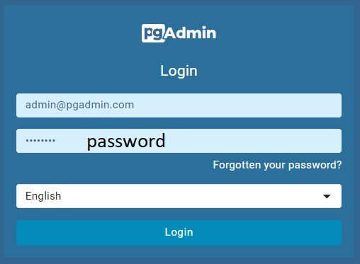
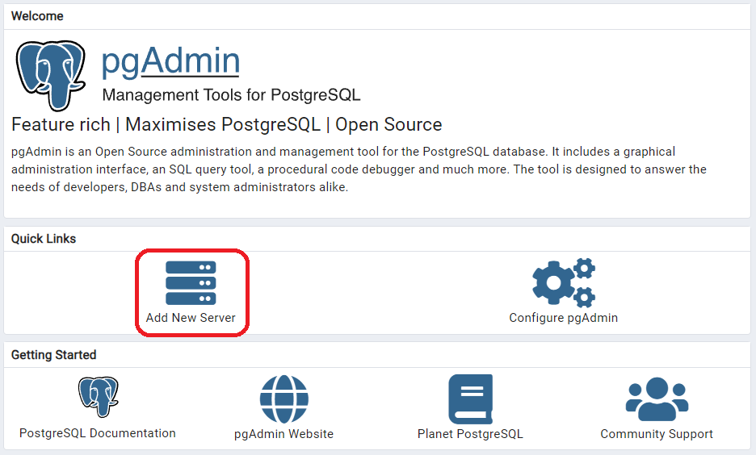
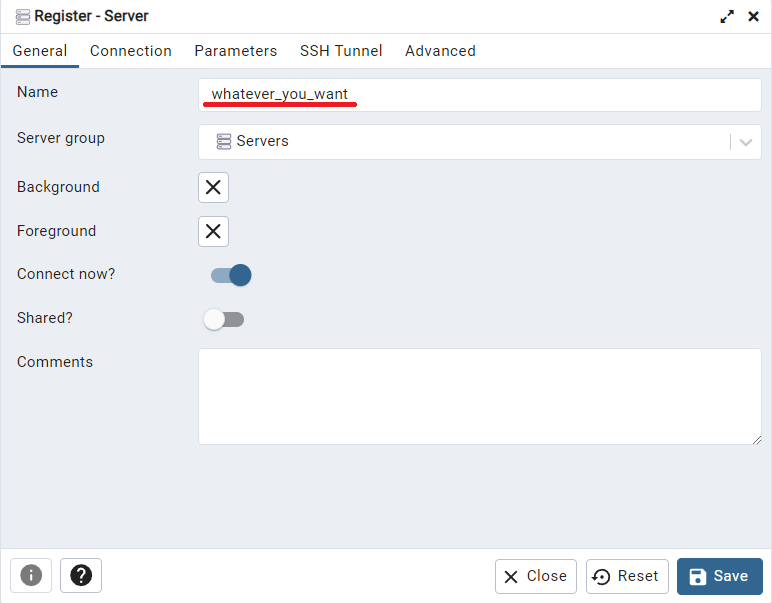
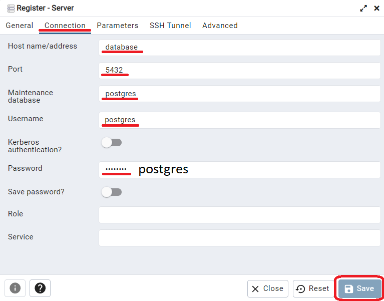
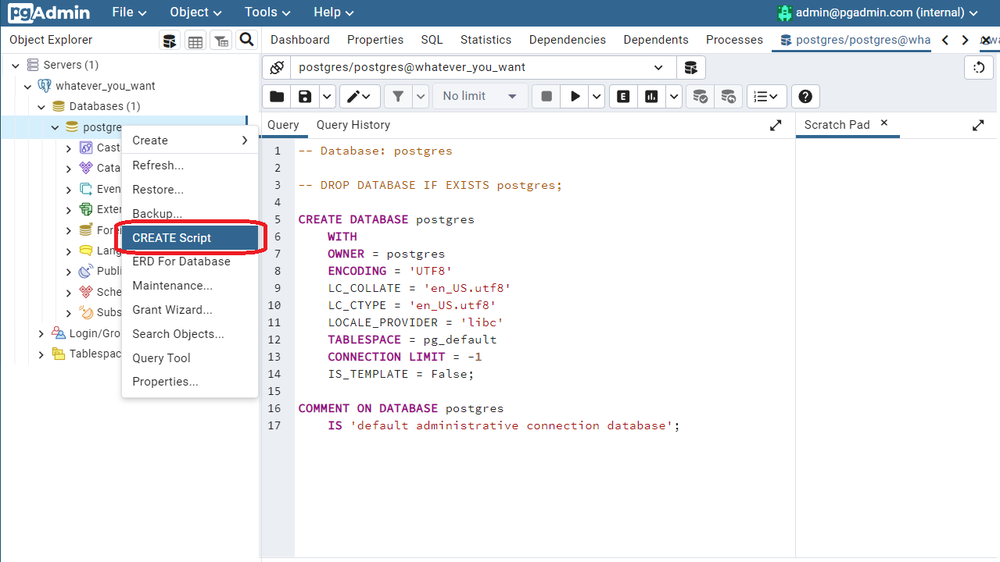
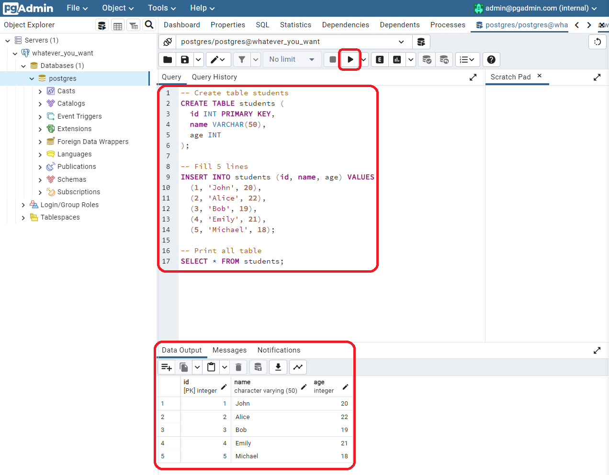

# Postgress + pgAdmin
## How to run

Run in console (**!NB**: run from current folder)

Update docker compose to version v2: https://docs.docker.com/compose/install/linux/

```BASH
docker compose -f docker-compose.yaml up
```

Open http://localhost:15432/ and login
* login: **admin@pgadmin.com**
* password: **password**



Connect to postgres server



Set name of connection



Set conection



Create new script



Fill with code and run

```SQL
-- Create table students
CREATE TABLE students (
  id INT PRIMARY KEY,
  name VARCHAR(50),
  age INT
);

-- Fill 5 lines
INSERT INTO students (id, name, age) VALUES
  (1, 'John', 20),
  (2, 'Alice', 22),
  (3, 'Bob', 19),
  (4, 'Emily', 21),
  (5, 'Michael', 18);

-- Print all table
SELECT * FROM students;
```



## Possible issues
### docker engine is not run (win)
```BASH
error during connect: this error may indicate that the docker daemon is not running: Get "http://%2F%2F.%2Fpipe%2Fdocker_engine/v1.24/containers/json?all=1&filters=%7B%22label%22%3A%7B%22com.docker.compose.config-hash%22%3Atrue%2C%22com.docker.compose.project%3Dpostgress%22%3Atrue%7D%7D": open //./pipe/docker_engine: The system cannot find the file specified
```
### fix
```BASH
wsl --update
```

and then **reboot**